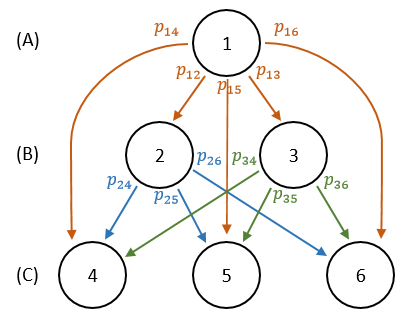

## Introduction

Modelling infectious diseases can help in understanding the dynamics of and controlling the diseases. By being able to model outbreaks, we can figure out where to focus interventions and potentially stem the further spread of the outbreak. Many models use stochastic processes. In this page, I will describe a couple methods for estimating the reproductive number of a disease which use stochastic processes.


## The Reproductive Number

One parameter of interest for infectious disease is the reproductive number, which is defined as the average number of secondary cases of disease stemming from a primary case. In other words, it is the average number of people that an infected individual infects. The basic reproductive number, $R_0$, is constant and assumes an entirely susceptible population, whereas the effective reproductive number, $R_t$ can vary over time and takes into account other population-level parameters. The reproductive number cannot be observed as it is impossible to always know who infects whom, so it must be estimated.


## Using Markov Chains in Estimation

### Wallinga-Teunis method

The Wallinga-Teunis method was initially developed for estimating the reproductive number for severe acute respiratory syndrome (SARS) and has been used extensively with influenza, tuberculosis, and other infectious diseases. 

The probability of someone who got infected at time $j$ infecting someone at time $i$ is

$$
    p_{ij} = \frac{w(t_i-t_j)}{\sum_{l \neq i}w(t_i-t_l)}
$$
where $w(t)$ is the serial interval. 

The effective reproductive number, $R_{t}$, is then found by adding every probability over time $i$, holding $j$ constant. 

$$
    R_{t} = \sum_{i \neq j}p_{ij}
$$


#### Serial Interval

As mentioned earlier, the serial interval can be described using a probability distribution. We had assumed it to follow a multinomial distribution, but gamma, normal, and Weibull distributions are often used as well. The parameters of the distribution vary depending on the disease.

It is necessary to discretize the serial interval distribution prior to use, as the cases of disease are recorded in discrete time units, be it days, weeks, months, or any other units of interest. This is done simply by finding $P(t_1<X<t_2)$, where $t_1$ and $t_2$ are two consecutive days/weeks/months, and X is the day/week/month of interest. 

The serial interval does not depend on specific dates, but rather on the difference in time between the infection of the primary and secondary cases. It is clear that it possesses the Markov property. The function $w(t)$ is used to find the value of the serial interval, that is, the probability of infection, when the difference is $t$ units. If a secondary case was infected at time $t_b$ by a primary case who was infected at time $t_a$, then probability of infection, based solely on time, is $w(t_b-t_a)$.


#### Implementation

The probability of infection depends not only on the time between primary and secondary infections, but on the number of individuals within each generation as well.

Figure 1 shows a network of infection with six individuals, 1 in the first generation (A), 2 in the second generation (B), and 3 in the third generation (C). It is not necessary that subsequent generations have more individuals than previous ones. The probability that individual 1 infects individual 2 is given by $p_{12}$ and must be equal to 1, as individual 1 is the only potential infector of 2, and likewise for $p_{13}$. Notice that so far in this formulation, the probabilities from the infector, $i$, do not necessarily sum to 1, but the probabilities to the infectee, $j$, must sum to 1.

<center>

</center>


The pseudo-probability matrix for this infection graph can be written as

$$
P^* = \begin{bmatrix}
p_{11} & ... & p_{16}\\
...& & ...\\
p_{61} & ... & p_{66}\\
\end{bmatrix}
$$

In order to get a true probability matrix where each row sums to 1, we must weigh this matrix by the number of individuals at each time point, which is represented by column vector $V$.

$$
P_{ij} = \frac{P^*_{ij}}{P^* \times V}
$$

To get the time varying reproductive number, simply take the column sum:

$$
R_t = \sum_{i \neq j}P_{ij}
$$


Source:

Wallinga J, Teunis P. Different Epidemic Curves for Severe Acute Respiratory Syndrome Reveal Similar Impacts of Control Measures. Am. J. Epidemiol. [electronic article]. 2004;160(6):509–516. (https://academic.oup.com/aje/article-lookup/doi/10.1093/aje/kwh255). (Accessed July 8, 2018)


### Case study: COVID-19 in Massachusetts

Right now, researchers are particularly interested in modelling COVID-19. Here, I will apply the Wallinga-Teunis method to estimate the reproductive number in Massachusetts. It is important to note that this method works better for longer periods of time, and results for limited data may be inconclusive. I will be using a serial interval which follows a normal distribution with mean of 3.96 days and standard deviation of 4.75.

```{r, message=FALSE, warning = FALSE}
library(ggplot2)
library(dplyr)
library(httr)
library(RCurl)

# estimation function
find_rts = function(dat, mu = 3.96, sigma = 4.75, k = 18){
  # estimate reproductive numbers for single region
  
  dates = seq(1, nrow(dat))
  
  # get discrete normal distribution density
  ps.si = rep(0,k)
  for(i in 1:k){
    ps.si[i] = pnorm(i, mean = mu, sd = sigma) - pnorm(i-1, mean = mu, sd = sigma)
  }
  ps.si = ps.si/sum(ps.si) # this ensures that the ps add to one and make a true distribution
  
  # get weights from serial distribution
  si.weights = matrix(nrow = length(dates), ncol = length(dates))
  for(t1 in 2:length(dates)){
    for(t2 in 1:length(dates)){
      dateDiff = dates[t1] - dates[t2]
      p.si = ifelse(dateDiff>0, ps.si[dateDiff], 0)
      si.weights[t1,t2] = p.si
    }
  }
  si.weights[1,] = 0
  si.weights[is.na(si.weights)] = 0
  
  reweighed.row.sum = si.weights%*%dat$cases
  reweighed.prob = si.weights/as.vector(reweighed.row.sum)
  reweighed.prob[is.na(reweighed.prob)] = 0
  
  rts = colSums(reweighed.prob*dat$cases)
  
  to_save <- data.frame(dat$date, rts)
  colnames(to_save) <- c('date', 'rts')
  
  #write.csv(to_save, file = paste('output/', file_name, '.csv', sep=''), row.names = FALSE)
  return(to_save)
}


# read in the data
dat_us = read.csv(text=getURL('https://raw.githubusercontent.com/COVID19Tracking/covid-tracking-data/master/data/states_daily_4pm_et.csv'))
dat_us$date = substr(dat_us$date, 3, length(dat_us$date))
dat_us$date = gsub("(\\d{2})(?!=\\d?$)", "\\1-", dat_us$date, perl = TRUE)
dat_us$date = as.Date(dat_us$date, format = "%y-%m-%d-")

ma = dat_us %>% filter(state == 'MA') %>% select(date, positive)
colnames(ma) = c('date', 'cases')
ma = ma[order(ma$date), ]

# plot cases
ggplot(ma, aes(date, cases)) +
  geom_line(size = 1) + 
  ggtitle('Cases of COVID-19 in Massachusetts, 2020')


# get the estimates
est = find_rts(ma)
est$date = as.Date(ma$date)

# plot
start = '2020-03-14'
end = '2020-03-30'

ggplot(est, aes(date, rts)) +
  geom_line(size = 1) +
  scale_y_continuous(limits = c(0,7), expand = c(0,0)) +
  scale_x_date(limits = c(as.Date('2020-03-04'), as.Date('2020-04-13')), expand = c(0, 0), 
               date_breaks = '1 week', date_labels = "%b %d") +
  ggtitle('Reproductive Number of COVID-19 in Massachusetts, 2020') +
  xlab('Date') + ylab(expression('R'[t])) +
  geom_hline(yintercept = 1, linetype = "dashed") +
  geom_vline(xintercept = as.Date(start), color = 'red') +
  geom_vline(xintercept = as.Date(end), color = 'red')

  

start_index = which(est$date == start)
end_index = which(est$date == end)

# mean(est$rts[start_index:end_index])

```

Due to limitations in the estimation method, the first and last full length of the serial interval must be cut off, as indicated by the vertical red lines. The average reprodcutive number for COVID-19 in Massachusetts is estimated to be 2.97. 

If you have any questions about the code above, please contact me.


## Bonus section: Using Poisson Processes in Estimation

### White-Pagano Method
Laura White (Boston University School of Public Health Department of Biostatistics) and Anthony Pagano (Harvard School of Public Health Department of Biostatistics) developed an approach to estimating the reproductive number using maximum likelihood. This method assumes that infections follow a Poisson process.

The method can be described as follows:

Each infected individual generates a number of cases which follows a Poisson distribution with $\lambda = R_0$, where $R_0$ is the basic reproductive number. We can assume the following: all individuals are equally as likely to get infected and these infections are independent. Additionally, there is no movement in and out of the population and primary cases show symptoms prior to secondary cases. In a population with $N_0$ initial primary cases, $X_0$ secondary cases are produced with $X_0 \sim Pois(N_0R_0)$. 

The reproductive number can vary over time, so that for each time, $i$, there are $N_i$ primary cases, which produce $X_{ij}$ total cases, where $i$ is the time at which the infector (primary case) presented symptoms and $j$ is time at which the infectee (secondary case) presented symptoms, such that $N_i = \sum_{i=j-k}^{j}X_{ij}$, where $k$ is the maximum length of the infectivity period. The values $X_{ij}$ must be known to estimate $R_0$.

Another necessary parameter for estimating the reproductive number is the serial interval of the disease, which is the distribution of time between when symptoms arise in primary and secondary cases. Here, we assume that the serial interval follows a multinomial distribution. The serial interval is often not known and must also be estimated.

The reproductive number can be estimated using maximum likelihood estimation. Let $\textbf{p}$ be a vector of probabilities at each time point $p_i$:

$$
    \begin{split}
        L(R_0, \textbf{p}|\textbf{N,X}) = \left[\frac{e^{-N_0R_0}(N_0R_0)^{X_0}}{X_0!}\right] \left[\binom{X_0}{X_{01} \cdot\cdot\cdot X_{0, 1+k}}p_1^{X_{01}}\cdot\cdot\cdot p_k^{X_{0,k}} \right] \\ \times \left[\frac{e^{-N_1R_0}(N_1R_0)^{X_1}}{X_1!}\right] \left[\binom{X_1}{X_{12} \cdot\cdot\cdot X_{1, 1+k}}p_1^{X_{12}}\cdot\cdot\cdot p_k^{X_{1,k}} \right] \\ \times \cdot\cdot\cdot \times \left[\frac{e^{-N_TR_0}(N_TR_0)^{X_T}}{X_T!}\right] \left[\binom{X_T}{X_{T,T+1} \cdot\cdot\cdot X_{T, T+k}}p_1^{X_{T,T+1}}\cdot\cdot\cdot p_k^{X_{T,T+k}} \right]
    \end{split}
$$

Which reduces to (see source for details):

$$
L(R_0, \textbf{p}) = \prod_{t=1}^{T}\frac{e^{-\mu_t}\mu_t^{N_t}}{N_t!}
$$

Where
$$
\mu_t = R_0\sum_{j=1}^{min(i,t)}N_{t-j}p_j
$$

It is apparent that it is not actually necessary to know $X_{ij}$ to estimate $R_0$, only the number of infected at time $i$, $N_i$, and probability of infection at time $i$, $p_i$ must be known.


Source: 

White LF, Pagano M. A likelihood-based method for real-time estimation of the serial interval and reproductive number of an epidemic. Stat. Med. [electronic article]. 2008;27(16):2999–3016. (http://www.ncbi.nlm.nih.gov/pubmed/18058829). (Accessed June 29, 2018)

